<p align="center">
  
</p>

<p align="center">
  
  
  
  
  
  
</p>

# Shiro 白

**The AI desktop for people who build with AI.**

A local-first autonomous agent for macOS. Watches your screen, listens to your meetings, remembers your work, spawns parallel sub-agents, and plugs into the MCP ecosystem (GitHub, Composio, Context7, HuggingFace).

Built on the patterns of [Fazm](https://github.com/mediar-ai/fazm) — rebuilt local-only, with real sub-agents and production-grade RAG on top.

---

## Status

**Alpha / heavy WIP.** Phase 0 (foundation) is committed. Phase 1 (Node bridge) is active. See [`PLAN.md`](./PLAN.md) for the full build spec — every module designed before a line ships.

---

## What it does

| Capability | Detail |
|---|---|
| **Parallel sub-agents** | Atomic SQL checkout, persona injection, depth & budget guards |
| **Hybrid RAG** | `sqlite-vec` + FTS5 in one SQLite file — auto-ingests code, papers, meetings, screen history |
| **Knowledge graph** | Live-updating on every tool call. Query with `/kg <topic>` |
| **MCP ecosystem** | Declarative `~/.shiro/mcp.yaml` — Playwright, GitHub, Composio, Context7, HuggingFace, filesystem |
| **Meeting mode** | ScreenCaptureKit audio + Deepgram Nova-3 streaming STT — action items extracted live, approval-gated |
| **Skills system** | Claude Code-compatible `.skill.md` format — 60+ skills planned across 6 packs |
| **Bring-your-own-model** | Hot-swap LM Studio, Ollama, or Claude — local-first by default |

---

## Stack

```
Swift + SwiftUI          macOS native app (floating bar, task board, meeting overlay, KG viewer)
GRDB + sqlite-vec        local memory, hybrid RAG, knowledge graph
Node 20 + TypeScript     agent bridge, tool dispatch, ACP protocol
LM Studio / Ollama       local inference (primary) — Claude as cloud fallback
Deepgram Nova-3          streaming speech-to-text for meeting mode
MCP servers              external tool integrations
```

---

## Local model setup (48 GB RAM)

| Role | Model | VRAM |
|------|-------|------|
| Brain | `google/gemma-4-26b-a4b` | 18 GB |
| Fast | `qwen/qwen3-8b` | 4.6 GB |
| Vision | `qwen/qwen2.5-vl-7b` | 6 GB |
| Embed | `text-embedding-embeddinggemma-300m-qat` | 0.2 GB |

All run simultaneously in LM Studio (~29 GB resident).

---

## Build & run

```bash
git clone https://github.com/abhisheksharma001/shiro.git
cd shiro
./setup.sh          # installs Node bridge deps + MCP servers
open Shiro.xcworkspace   # build & run in Xcode with ⌘R
```

Requires macOS 14+ (Sonoma), Xcode 15+, and LM Studio or Ollama running locally.

---

## Roadmap

- [x] Phase 0 — project scaffold, agent coordinator, bridge architecture
- [ ] Phase 1 — Node/ACP bridge fork, LM Studio proxy
- [ ] Phase 2 — hybrid RAG + knowledge graph
- [ ] Phase 3 — MCP registry + bundled servers
- [ ] Phase 4 — meeting mode (audio + STT + action items)
- [ ] Phase 5 — skills system + slash commands

---

## Credits

- **[Fazm](https://github.com/mediar-ai/fazm)** — Swift↔Node ACP bridge pattern and SkillInstaller inspiration
- **Paperclip (Mediar-AI)** — task state machine + atomic checkout pattern
- **[Claude Code](https://docs.anthropic.com/en/docs/claude-code)** — skill format, slash commands, hooks engine

---

## License

MIT — see [`LICENSE`](./LICENSE).

*Built in the open by [@abhisheksharma001](https://github.com/abhisheksharma001)*
